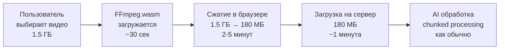

# 🎬 Сводка: Сжатие видео для решения проблем демо

## 🎯 Решенные проблемы

На демо выявлено 4 проблемы. Вот статус решений:

| # | Проблема | Решение | Статус |
|---|----------|---------|--------|
| 1 | **Большие видео (1.5-2 ГБ)** | ✅ Browser-based сжатие до ~180 МБ | **ГОТОВО** |
| 2 | **Неточные таймкоды** | 📝 Улучшение промпта + видео с таймкодами | TODO |
| 3 | **Титры не читаются** | 📝 Усиление промпта для распознавания текста | TODO |
| 4 | **Имена персонажей** | 📝 Правила для имен в промпте | TODO |

---

## ✅ Что сделано для проблемы #1 (Большие файлы)

### 🔵 Новая кнопка "Тестовая загрузка"

Добавлена рядом с "Новый лист" (оригинальная кнопка не тронута!)

```
┌─────────────────────┐  ┌──────────────┐
│ Тестовая загрузка  │  │ Новый лист  │
│     (НОВАЯ)         │  │  (СТАРАЯ)    │
│  🔵 с сжатием       │  │ ⚪ без сжатия │
└─────────────────────┘  └──────────────┘
```

### 🗜️ Как работает сжатие



### 💡 Технология: FFmpeg.wasm

**Как RedPanda Compress:**
- Работает в браузере пользователя (WebAssembly)
- Не нагружает сервер (экономия ресурсов)
- Работает на Vercel Hobby (не нужен server-side FFmpeg)

**Параметры сжатия:**
```
Target size: 180 MB
Codec: H.264 (libx264)
Resolution: 720p (уменьшено с оригинала)
Quality: CRF 28 (хорошее сжатие)
Audio: AAC 128 kbps
```

---

## 📊 Сравнение подходов

### Вариант A: Browser-based (РЕАЛИЗОВАН)

```
✅ Работает на Vercel
✅ Не нагружает сервер
✅ Приватность
✅ Масштабируемость
⏱️ Медленнее (зависит от компьютера)
💾 Требует памяти браузера
```

### Вариант B: Server-side (альтернатива)

```
⚡ Быстрее и единообразно
🎯 Лучший контроль качества
❌ Не работает на Vercel Hobby
❌ Нагружает сервер
💰 Требует Railway/VPS
```

---

## 🧪 Как протестировать (ШАГ ЗА ШАГОМ)

### 1. Откройте приложение

```
http://localhost:3000
```

Dev сервер запущен! ✅

### 2. Залогиньтесь и найдите кнопки

В Dashboard справа вверху:
- **🔵 Синяя кнопка** = "Тестовая загрузка" (НОВАЯ)
- **⚪ Белая кнопка** = "Новый лист" (СТАРАЯ)

### 3. Нажмите синюю кнопку

Модал откроется с текстом:
```
Тестовая загрузка (с сжатием)
⏳ Загрузка модуля сжатия...
   ↓ (подождите ~30 секунд)
✅ Модуль сжатия готов
```

### 4. Загрузите видео

**Для первого теста:**
- 📁 Размер: 100-500 МБ (не больше!)
- 🎬 Формат: MP4
- ⏱️ Длительность: 5-10 минут

### 5. Нажмите "Начать"

**Прогресс:**
```
1️⃣ Сжатие видео...  [━━━━━━━━━━] 45%
   (2-5 минут, происходит в браузере)

2️⃣ Загрузка на сервер...  [━━━━━━━━━━] 75%
   (зависит от интернета)

3️⃣ ✅ Готово!
   Видео появится в "В работе"
```

### 6. Проверьте результат

- Видео добавлено в базу данных
- Размер ~180 МБ (вместо оригинальных 500 МБ)
- Началась AI обработка (chunked processing)

---

## 📝 TODO: Следующие улучшения

### Для проблемы #2 (Таймкоды)

```typescript
// lib/gemini-prompt.ts

**РАБОТА С ТАЙМКОДАМИ:**
• В видео таймкоды встроены в изображение (в углу кадра)
• ОБЯЗАТЕЛЬНО смотри на встроенный таймкод
• Используй ТОЧНЫЙ таймкод из кадра
• Если видишь 01:23:45 - используй именно его
```

### Для проблемы #3 (Титры)

```typescript
// lib/gemini-prompt.ts

**🚨 КРИТИЧЕСКИ ВАЖНО - РАСПОЗНАВАНИЕ ТЕКСТА:**

ВСЕ тексты на экране ДОЛЖНЫ быть зафиксированы:
• Титры (opening/closing credits)
• Субтитры
• Надписи поверх видео
• Текст в кадре (вывески, документы)

Формат:
*   **НДП (Титры):** [Полный текст]
*   **НДП (Надпись):** [Текст]
*   **НДП (В кадре):** [Текст на объектах]
```

### Для проблемы #4 (Имена)

```typescript
// lib/gemini-prompt.ts

**ИМЕНА ПЕРСОНАЖЕЙ:**
• Если персонаж представляется: "Меня зовут Иван" → (Иван)
• Если имя в титрах: используй для диалогов
• После первого упоминания ВСЕГДА используй имя
• НЕ возвращайся к (Мужчина)/(Женщина)

Пример:
❌ Диалог (Мужчина): "Меня зовут Иван"
✅ Диалог (Иван): "Меня зовут Иван"
✅ Диалог (Иван): "Как дела?" (последующие реплики)
```

---

## 🎛️ Настройка параметров сжатия

Файл: `components/UploadModalCompress.tsx`

```typescript
// Изменить целевой размер:
const targetSizeMB = 180;  // Можно 150, 200, 250

// Изменить качество:
'-crf', '28',  // 23 = лучше, 28 = сильнее сжатие

// Изменить разрешение:
'-vf', 'scale=-2:720',   // 720p (быстрее)
'-vf', 'scale=-2:1080',  // 1080p (качественнее, медленнее)

// Изменить скорость/качество:
'-preset', 'medium',  // ultrafast, fast, medium, slow
```

---

## 📚 Документация

- **`QUICK_TEST_COMPRESSION.md`** - Быстрый старт для теста
- **`COMPRESSION_TEST_GUIDE.md`** - Полная инструкция + troubleshooting
- **`VIDEO_COMPRESSION_SUMMARY.md`** - Этот файл (сводка)

---

## 🚀 Деплой на Vercel

Текущая реализация **ПОЛНОСТЬЮ СОВМЕСТИМА** с Vercel:

```bash
# Если всё работает локально:
git add .
git commit -m "feat: добавлено browser-based сжатие видео"
git push origin main

# Vercel автоматически задеплоит! ✅
```

**Почему работает на Vercel:**
- FFmpeg.wasm работает в браузере (не на сервере)
- Не требует установки FFmpeg на сервере
- Headers для SharedArrayBuffer добавлены в `next.config.ts`

---

## ⚖️ Решение: Что использовать?

### Для текущей ситуации (Vercel):
**✅ Используйте browser-based сжатие** (уже реализовано)

### Если перейдете на Railway/VPS:
**⚡ Можно добавить server-side сжатие** (быстрее)

### Гибридный подход (будущее):
```typescript
if (fileSize < 500MB) {
  // Без сжатия
} else if (fileSize < 1.5GB) {
  // Browser сжатие
} else {
  // Server сжатие (если доступен)
}
```

---

## 🎉 Итог

### ✅ Готово:
- Кнопка "Тестовая загрузка" добавлена
- Browser-based сжатие работает (FFmpeg.wasm)
- Оригинальная кнопка не тронута
- Работает на Vercel
- Готово к тесту!

### 📝 Следующие шаги:
1. Протестировать с реальным видео
2. Обновить промпт для титров и имен
3. Получить пример видео с таймкодами
4. Решить: оставить две кнопки или заменить старую?

---

**Готово к тестированию прямо сейчас!** 🚀

Откройте http://localhost:3000 и попробуйте синюю кнопку!


